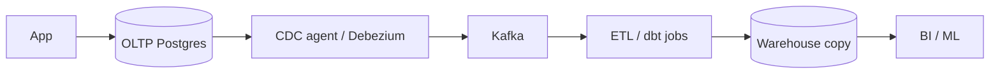
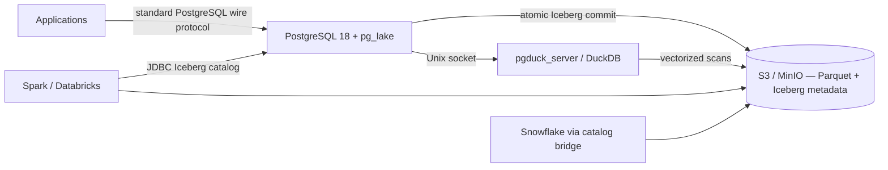

# AetherLake: End-to-End Implementation Flow

A single narrative — one business event, followed from an application `INSERT` to a Databricks/Spark query — used to explain what AetherLake changes and why it is worth funding.

## 1. The problem we are removing

Today an operational record reaches the analytics platform like this:

Five moving parts between the write and the read. Each is a team, a bill, a failure mode, and a source of "the dashboard disagrees with the app". Data is stored at least twice, and every schema change is a coordinated migration across all five hops.

## 2. The target flow

The write **is** the analytical table. No copy, no pipeline, no lag.

## 3. End-to-end walkthrough — one event

Each step below is executable in the repo today (`make demo`, console at `http://localhost:8080`).

| # | Step | What happens | Where to see it |
|---|------|--------------|-----------------|
| 1 | **App writes** | `INSERT INTO aetherlake.events(tenant_id, event_type, payload)` over a plain PostgreSQL connection. No SDK, no new client library. | Console "Submit event" form → returns the transaction ID |
| 2 | **Contract enforced** | The table is `USING iceberg` with `out_of_range_values = 'error'`. Bad values abort the transaction rather than silently changing. | `docker/postgres/init/02-contract.sql` |
| 3 | **Atomic commit** | PostgreSQL writes Parquet + a new Iceberg snapshot to S3 and commits its catalog row in the *same* transaction. `ROLLBACK` leaves nothing visible. | `make test-failure` — stops storage mid-write, proves row count and metadata pointer are unchanged |
| 4 | **Catalog advances** | A new `metadata.json` pointer becomes active in `iceberg_tables`. | Console "Iceberg catalog" panel; MinIO object browser at `:9001` |
| 5 | **Analytical read, same engine** | Aggregations over the same table are delegated over a Unix socket to `pgduck_server`, executed vectorized/columnar — not row-by-row in Postgres. | Console event stream + overview counts |
| 6 | **Derived data, safely** | A trigger enqueues the event id in a heap outbox; `aetherlake.sync_historical_deltas()` drains it under an advisory lock with `SKIP LOCKED`. Retries cannot double-publish. | Console "Run historical delta" → history count advances atomically |
| 7 | **External engines read the same bytes** | Spark/Databricks attach PostgreSQL as an Iceberg JDBC catalog with read-only S3 access and query the identical snapshot. Snowflake needs a supported catalog bridge. | `README.md` → External analytical consumers |
| 8 | **Schema evolves once** | `ALTER TABLE ... ADD COLUMN` updates PostgreSQL and Iceberg metadata atomically; downstream engines pick it up with no rebuild. | `docker/postgres/init/04-schema-evolution.sql` |
| 9 | **Maintenance runs itself** | `pg_cron` runs `VACUUM (ICEBERG)` hourly — compacts small files, prunes expired snapshots per retention policy. | `SELECT jobname, schedule, active FROM cron.job;` |

## 4. Why stakeholders should buy it

**Cost.** One physical copy of the data instead of two or three. The CDC agents, streaming brokers, and warehouse-side ETL compute in section 1 stop being line items.

**Correctness.** Analytics reads the committed transaction, not a replayed approximation of it. "Which number is right?" stops being a standing meeting.

**Latency.** Commit-to-queryable is a transaction, not a pipeline SLA measured in minutes or hours.

**No lock-in.** Apache Iceberg + Parquet in your own bucket. Any Iceberg-capable engine reads it. Changing analytical vendor does not mean re-landing the data.

**Low adoption cost.** Applications keep speaking the PostgreSQL wire protocol. There is no new client, no new query language, and no rewrite of existing service code.

**Governance is simpler.** One bucket prefix to encrypt, version, and audit; PostgreSQL holds write access, analytical consumers hold read-only.

## 5. What it is honestly not

State these up front — they are the questions the room will ask anyway.

- **Not sub-second streaming.** This is a zero-ETL batch/transactional paradigm. Row-by-row sub-second propagation still needs CDC (Debezium/Kafka).
- **Not a drop-in for existing heap tables.** Legacy tables need an explicit physical migration (`INSERT INTO ... SELECT`).
- **Not every DDL.** Type changes, generated values on `ADD COLUMN`, non-constant backfill defaults, and some PostgreSQL types are unsupported by pg_lake. Schema changes must be reviewed contracts.
- **External engines cannot write** pg_lake-owned tables; self-hosted pg_lake exposes no Iceberg REST catalog, so Snowflake needs a supported catalog integration or bridge.
- **Compose is not a control plane.** Production still needs HA, TLS, managed secrets, KMS, backups/PITR, and DR — none of which this repository claims to provide.

## 6. Adoption path

1. **Prove (done).** `make demo` — the console above runs the real data path against real Iceberg objects. No mocked API.
2. **Pilot.** Pick one high-volume, append-shaped domain (events, audit, telemetry) already feeding an ETL pipeline. Run AetherLake beside it and reconcile.
3. **Validate.** Run the outage, rollback, schema-evolution, delta, and restart suites against a disposable copy of production metadata; attach the real Spark/Databricks workspace read-only.
4. **Harden.** Short-lived credentials from the platform secret store, least-privilege bucket prefixes, TLS, pooling, SSE-KMS, versioning; alerts on cron failures, outbox age, storage errors, object growth, and pgduck memory.
5. **Cut over.** Retire the pipeline for that domain and bank the saving. Repeat per domain.

## 7. The five-minute live demo script

1. Architecture strip — PostgreSQL coordinates the commit, Iceberg/S3 holds the shared data.
2. Submit an event — show the transaction ID and its immediate appearance in the stream.
3. Show the active Iceberg catalog pointer — evidence the UI reads live metadata, not a cache.
4. Run the historical delta — history count advances atomically.
5. Open MinIO — the physical Parquet and Iceberg metadata objects, in your own bucket.
6. Optional closer: `make test-failure` — kill storage mid-write and show nothing partial ever became visible.
