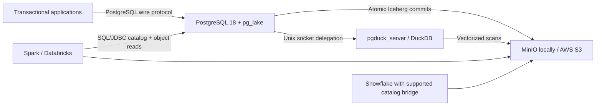

# Project AetherLake

AetherLake is a contract-first PostgreSQL lakehouse foundation. Applications use ordinary PostgreSQL connections and write canonical tables backed directly by Apache Iceberg. PostgreSQL and `pg_lake` coordinate ACID transactions and catalog metadata, while the separate `pgduck_server` sidecar executes vectorized analytical work. Parquet data and Iceberg metadata live in S3-compatible storage, so compatible analytical engines read the same physical data without a replication pipeline.

## Stakeholder demo

The repository includes a presentation-ready web console that demonstrates the real data path—there is no mocked API or decorative dashboard. It can commit a new event into an Iceberg-backed PostgreSQL table, display the latest events, expose active Iceberg metadata pointers and extensions, and trigger the idempotent historical-delta procedure.

Start the entire demo with one command:

```bash
make demo
```

On the first run, the command creates `.env`, compiles the pinned pg_lake/PostgreSQL/pgduck base images, builds every Compose service, and waits for the whole stack to become healthy. Native compilation can take 20–60 minutes depending on the machine; later starts reuse Docker’s cache.

Open:

- Stakeholder console: [http://localhost:8080](http://localhost:8080)
- MinIO object browser: [http://localhost:9001](http://localhost:9001)

Suggested five-minute walkthrough:

1. Use the architecture strip to explain that PostgreSQL coordinates the commit while Iceberg/S3 holds the shared analytical data.
2. Submit a live event and point out the returned transaction ID and immediate appearance in the event stream.
3. Show the active Iceberg catalog pointers as evidence that the UI is reading live metadata.
4. Run the historical delta and show that the history count advances atomically.
5. Open MinIO to show the physical Parquet and Iceberg metadata objects.

For direct Compose usage after the base images exist:

```bash
docker compose up -d --build
./scripts/wait-healthy.sh
```

> This repository is production-oriented boilerplate, not a production control plane. Docker Compose intentionally does not claim to provide high availability, TLS termination, managed secrets, KMS, backups, or disaster recovery.

## Architecture



`pgduck_server` is not loaded into the PostgreSQL process. It is a separate, multi-threaded sidecar connected over a private Unix socket shared by the two containers. PostgreSQL remains the only application-facing SQL endpoint.

## Repository layout

```text
models/                     Cognite Toolkit YAML: the EDM, the SDM, vendored CDM types
scripts/compile-model.py    Compiles that YAML into Iceberg tables, views and metadata
docker/postgres/init/       Ordered database contracts and schedules
docker/postgres/            Hardened PostgreSQL startup configuration
docker/pgduck/              Environment-rendered DuckDB S3 secret
docker/minio/               Idempotent local bucket bootstrap
demo-ui/                    Stakeholder console and live PostgreSQL API
examples/                   Optional external Iceberg mount
scripts/                    Reproducible build and readiness tooling
tests/                      Transaction, metadata, and outage validation
```

The architectural requirements remain in [`requirements.md`](requirements.md).

## Prerequisites

- Docker Engine 24+ with Compose v2 and BuildKit
- Git
- At least 16 GB of memory assigned to Docker and substantial free disk space
- Bash 4+

The first build compiles PostgreSQL, pg_lake, DuckDB, and their native dependencies. It is intentionally slow. Subsequent builds use Docker layer caching.

`PG_LAKE_BUILD_JOBS` defaults to `2` to keep DuckDB compilation within an 8 GB Docker memory allocation. Increase it only when Docker has materially more memory; use `1` on constrained CI runners.

The ARM64 demo build treats DuckDB's `spatial` extension as optional. The custom pgduck binary reports version `v0.0.1`, for which DuckDB's public repository does not publish an ARM64 spatial artifact; a failed spatial download therefore emits a warning instead of terminating pgduck. Core Iceberg, Parquet, S3, and analytical execution remain available. Geospatial workloads require building and packaging a matching spatial extension.

## Local development

```bash
make bootstrap
# Review and change every local password in .env.
make build
make up
make test
```

Endpoints after startup:

- PostgreSQL: `localhost:5432`
- MinIO S3 API: `localhost:9000`
- MinIO console: `http://localhost:9001`

Connect with:

```bash
set -a; source .env; set +a
PGPASSWORD="$POSTGRES_PASSWORD" psql \
  -h localhost -U "$POSTGRES_USER" -d "$POSTGRES_DB"
```

Useful commands:

```bash
make logs          # follow database, pgduck, and storage logs
make test-failure  # stop MinIO and prove failed writes remain invisible
make down          # stop services and preserve data
make reset         # destroy local volumes and reinitialize from scratch
```

## CDF data modelling on the lake

AetherLake runs Cognite Data Fusion's data-modelling semantics — spaces, containers, views,
direct and reverse relations, Enterprise and Solution Data Models — directly over Iceberg. The
model is authored once, in real Cognite Toolkit YAML, and that same YAML deploys to CDF and
compiles into this runtime.

```bash
make model        # cdf build, then compile to docker/postgres/init/08-model.sql
make model-check  # fail if the checked-in SQL has drifted from models/
```

The compiler reads `models/build/data_models/` — the output of `cdf build`, which is the exact
artifact CDF itself consumes — so Toolkit's variable substitution is never reimplemented and the
generated SQL is provably derived from what would be deployed.

| Toolkit concept | Becomes |
|---|---|
| schema space | a PostgreSQL schema |
| instance space | the `space` column value on every row, not a schema |
| container | an Iceberg table, `<space>.<snake(externalId)>`, **unversioned** |
| view | a PostgreSQL view, `<space>.<snake(externalId)>_<version>`, **versioned** |
| direct relation | a `text` column holding the target's `node_external_id` |
| reverse relation | metadata only — joined on demand, never a column |

The version living on the view rather than the table is the whole Cognite model in one naming
rule: containers are the durable contract, views are the query API, and v1 and v2 coexist for
free.

### The model

`WellProduction_DOM` (`dm_dom_well_production`) covers oil and gas production: a single `Asset`
view implementing `cdf_cdm:CogniteAsset` for the Draugen and Njord field/well/wellbore
hierarchy, `WellIntervention` implementing `cdf_idm:CogniteMaintenanceOrder`, and
`ProductionMeasurement` as a `usedFor: record` container. Records get no view by design — the
semantic layer covers the graph, and the analytical job reaches below it into the record store.

`ProductionAnalytics_SOL` (`dm_sol_production_analytics`) is the solution layer: one
denormalised `WellProductionDaily` view carrying well and field context on every row so a
dashboard reads a day of production without traversing.

Thirteen model rules are enforced at compile time and are build-fatal — every direct relation
needs a `source`, every property needs a description, reverse relations must satisfy
REVERSE-008/009, and at most one view per data model may implement `CogniteAsset`. That last one
is worth knowing: `cdf build` accepts a model that violates it; this compiler does not.

```bash
git apply demo/break-the-model.patch && make model   # exits 1
git checkout models/
```

### Querying through the semantic layer

`semantic.resolve(jsonb)` plans a CDF `/instances/list`-shaped request against the metadata and
runs it. It is not CDF's multi-result-set `/instances/query` graph, and does not claim to be.

```sql
SELECT jsonb_pretty(semantic.resolve('{
  "space": "dm_dom_well_production", "view": "Asset", "version": "v1",
  "properties": ["name", "wellType"],
  "filter": {"equals": {"property": ["assetType"], "value": "well"}},
  "traverse": [{"property": "interventions", "properties": ["name", "status"]}],
  "limit": 5, "explain": true
}'::jsonb));
```

`explain` returns the generated SQL verbatim, plus the Iceberg snapshot id of every table read.

Governance is a privilege boundary rather than a convention: `APP_USER` holds `USAGE` on
`semantic` and on no model schema, so instance data is reachable only through a function that
refuses anything the model does not declare. An undeclared property or traversal raises
`22023`, which the console surfaces as `400`.

### The analytical job

`aetherlake.build_well_production_daily(from, to)` reads the compiled EDM **views** and the
record container, and writes the denormalised daily aggregate back into Iceberg. It reuses the
advisory-lock idiom from the delta loop, records lineage in `aetherlake.sdm_build_log` — source
views, their snapshot ids, and the target snapshot before and after — and runs on `SDM_CRON`
(default every ten minutes).

Delete-then-insert over a bounded window is the idempotency primitive: pg_lake supports `DELETE`
on Iceberg tables but not `MERGE` or `ON CONFLICT`.

### Scale

```bash
make seed-scale                    # 10M production readings, about a minute
make seed-scale ROWS=1000000       # or fewer
```

Measured on a laptop (Docker, 15 GB, 10 CPUs) against this pinned build:

| | |
|---|---|
| Bulk ingest into Iceberg | ~200k rows/sec |
| `production_measurement` | 10,025,920 rows in 325 Parquet files |
| SDM build over 10M readings | 7.4 s |
| `semantic.resolve()` on the solution view | ~21 ms |

Two shapes matter more than raw volume here, and both were found by measurement rather than
assumption:

- **Partitioning is a write-amplification decision, not just a read optimisation.** An earlier
  spec added `bucket(8, wellbore)` on top of `month(measured_at)`. With twelve distinct
  wellbores that bought no pruning while multiplying the files each `INSERT` writes: 125,920
  rows landed as **73,239** Parquet files, and pg_lake's own cleanup glob began failing with
  object-store connection errors. Time-only partitioning stores 10M rows in **325** files.
- **Bulk-load with few large statements, not many small ones.** Every committed transaction
  publishes an Iceberg snapshot and DML takes a table lock, so concurrent small writes
  serialise. `scripts/seed-scale.sh` inserts server-side in chunks; `load_test.py --target
  measurements` still exists to *measure* that contention, which is a different question.

```bash
make test-semantic   # the model is a contract: undeclared access is refused
make test-sdm        # idempotent, snapshot really advanced, no denormalisation drift
make test-openness   # DuckDB reads the SDM table from object storage, no PostgreSQL involved
make probe           # what this pinned pg_lake build actually supports
```

## Storage and connection contracts

All persistence settings are environment-driven. `.env.example` is safe to commit; `.env` is ignored. Both PostgreSQL and pgduck receive the same S3 credentials and endpoint contract.

For local MinIO, retain:

```dotenv
S3_ENDPOINT=http://minio:9000
S3_PATH_STYLE=true
S3_USE_SSL=false
```

For AWS S3, use an IAM role or workload identity instead of long-lived keys and set:

```dotenv
AWS_REGION=us-east-1
S3_ENDPOINT=https://s3.amazonaws.com
S3_PATH_STYLE=false
S3_USE_SSL=true
S3_BUCKET=your-production-bucket
S3_PREFIX=aetherlake/warehouse
```

The Compose credentials are for development only. In production, inject short-lived credentials through the platform secret store, restrict PostgreSQL to bucket-prefix read/write/list/delete, give analytical consumers read-only access, enable TLS, block public access, enable versioning, and configure SSE-KMS or the organization’s mandated encryption controls.

## Transaction contract

Canonical tables use `USING iceberg`. Each successful statement publishes a new Iceberg snapshot; PostgreSQL commits its catalog changes in the same transaction. The tables explicitly use `out_of_range_values = 'error'`, so values outside Iceberg’s representable range abort rather than silently changing.

```sql
BEGIN;
INSERT INTO aetherlake.events(tenant_id, event_type, payload)
VALUES (42, 'order.created', '{"order_id":"O-42"}');
ROLLBACK;

SELECT * FROM aetherlake.events WHERE tenant_id = 42; -- no row
```

Run `make test-failure` to stop MinIO, attempt a write, restart storage, and assert that the row count and active Iceberg metadata pointer did not change. Failed uploads may leave unreferenced objects; they are never catalog-visible and are reclaimed by Iceberg maintenance according to retention policy.

## Delta loop

The zero-ETL serving path does not need a delta copy: applications write `aetherlake.events` directly into Iceberg. The optional historical projection demonstrates a safe pg_cron loop for derived data:

- an insert trigger enqueues an event ID in a small heap outbox;
- `aetherlake.sync_historical_deltas()` takes a transaction-scoped advisory lock;
- rows are ordered, locked with `SKIP LOCKED`, archived, recorded in a heap ledger, and removed from the outbox in one transaction;
- retries cannot publish a duplicate ID through this procedure.

Inspect or run it manually:

```sql
SELECT jobname, schedule, command, active FROM cron.job;
CALL aetherlake.sync_historical_deltas(10000);
```

## Schema evolution

Standard supported DDL updates PostgreSQL and Iceberg metadata atomically:

```sql
ALTER TABLE aetherlake.events ADD COLUMN correlation_id text;
ALTER TABLE aetherlake.events RENAME COLUMN correlation_id TO trace_id;
ALTER TABLE aetherlake.events DROP COLUMN trace_id;
```

Inspect the active catalog and metadata:

```sql
SELECT * FROM aetherlake.catalog;

SELECT jsonb_pretty(lake_iceberg.metadata(metadata_location))
FROM iceberg_tables
WHERE table_namespace = 'aetherlake' AND table_name = 'events';
```

Type changes, generated values during `ADD COLUMN`, nonconstant backfill defaults, and some PostgreSQL types are not supported by pg_lake. Treat schema changes as reviewed contracts and test downstream type compatibility before deployment.

## External analytical consumers

Spark and compatible Iceberg libraries can use PostgreSQL as an Iceberg SQL/JDBC catalog. Give the catalog identity PostgreSQL `CONNECT` plus read-only catalog permissions and give the engine read-only S3 access. The catalog database name is the pg_lake database (`aetherlake` by default); metadata is exposed by `iceberg_tables`.

Databricks support depends on the runtime’s Iceberg JDBC catalog capability and organizational network policy. Configure the PostgreSQL JDBC driver, the Iceberg JDBC catalog implementation, and the same S3 location with read-only credentials.

Self-hosted open-source pg_lake does not itself expose an Iceberg REST catalog, and external engines cannot write pg_lake-owned tables. Snowflake deployments therefore require a catalog integration it supports, a catalog bridge, or Snowflake’s managed PostgreSQL/pg_lake integration. Do not poll and pin a changing `metadata.json` path as a production catalog strategy.

`examples/mount-external-iceberg.sql` shows the inverse, read-only case: PostgreSQL mounting an externally managed Iceberg metadata location.

## Maintenance and recovery

`pg_cron` runs `VACUUM (ICEBERG)` hourly by default. Vacuum compacts small files and reclaims expired metadata/data according to pg_lake’s retention behavior. Tune snapshot age for recovery objectives before production; immediate expiration removes useful recovery history.

Production deployments must additionally provide:

- PostgreSQL physical backups and tested point-in-time recovery;
- S3 versioning, retention, lifecycle, and cross-region policy;
- metrics and alerts for cron failures, outbox age, storage errors, object growth, query latency, and pgduck memory;
- a tested upgrade process that rebuilds pinned images and validates metadata compatibility in a staging bucket;
- connection pooling, TLS, network isolation, and least-privilege database roles.

## Pinned supply chain

`scripts/build-images.sh` builds the official Snowflake Labs multi-stage Dockerfile from the immutable `PG_LAKE_REF`, then builds the small AetherLake runtime overlays. PostgreSQL 18, pg_cron, pg_lake, and pgduck_server come from that pinned source tree. MinIO images are pinned to release tags.

When upgrading:

1. Review upstream release notes and dependency changes.
2. Change `PG_LAKE_REF` and the two base image tags together.
3. Build into new image tags; never overwrite a deployed immutable tag.
4. Run the full clean-bootstrap, rollback, outage, schema, delta, and restart suites.
5. Promote only after testing against a disposable copy of production metadata and objects.
