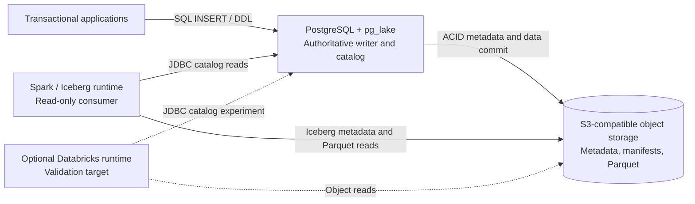

# Spark Interoperability Architecture

**Status:** Proposed design; external Spark validation pending  
**Scope:** Read-only Spark consumption of Iceberg tables written by PostgreSQL/pg_lake  
**Current catalog:** PostgreSQL-backed Iceberg JDBC catalog  
**Databricks status:** Compatibility experiment, not an accepted implementation

## 1. Purpose and boundary

AetherLake keeps PostgreSQL/pg_lake as the authoritative writer and Iceberg
catalog. Independent Spark consumers read the same committed Iceberg metadata
and Parquet files without querying through PostgreSQL or pgduck_server.

The supported baseline is:

```text
Application
    │ PostgreSQL SQL
    ▼
PostgreSQL + pg_lake ── atomic catalog pointer update ──► S3/MinIO
    │                                                     ▲
    │ JDBC catalog discovery                                │ S3FileIO reads
    ▼                                                     │
Spark + Iceberg ──────────────────────────────────────────┘
```

The consumer is read-only. External engines must not modify tables owned by
pg_lake because PostgreSQL owns the catalog pointer and table metadata lifecycle.

This design does not include:

- a new REST catalog service;
- Spark or Databricks writes into pg_lake-owned tables;
- ETL, CDC, or a second copy of the data;
- Databricks certification before a real Databricks runtime test.

## 2. High-level architecture



### Ownership

| Concern | Owner | Consumer behavior |
|---|---|---|
| Table schema and field IDs | pg_lake/PostgreSQL | Read and refresh |
| Current metadata pointer | PostgreSQL `iceberg_tables` | Discover through JDBC |
| Metadata/manifests/data files | S3-compatible storage | Read-only object access |
| Snapshot publication | PostgreSQL transaction | Never publish from Spark |
| Retention and vacuum | pg_lake maintenance | Must respect consumer lag |
| Authorization | PostgreSQL role + object-store policy | Dedicated read-only identity |

### Commit/read sequence

1. PostgreSQL executes a write against an Iceberg table.
2. pg_lake writes the new Iceberg metadata/data objects.
3. PostgreSQL commits the catalog pointer transactionally.
4. Spark resolves the table through the JDBC catalog.
5. Spark reads the returned metadata and Parquet files directly from object storage.
6. A later Spark planning operation observes a newer committed snapshot after its
   catalog cache expires or is refreshed.

## 3. Low-level design

### 3.1 Catalog identity and namespace

The catalog name must equal the PostgreSQL database name. With the repository
defaults:

```text
Catalog:    aetherlake
Namespace:  aetherlake
Table:      events
Spark name: aetherlake.aetherlake.events
```

The active local table currently uses PostgreSQL catalog metadata and an S3
location under the configured `S3_BUCKET`/`S3_PREFIX`. Consumers must discover
the current metadata location through the catalog; they must not hard-code or
poll a `metadata.json` path.

### 3.2 Spark catalog configuration

The following is the baseline configuration shape. Match Spark, Iceberg, and
PostgreSQL JDBC driver versions as one tested set; the pinned pg_lake source
documents an Iceberg Spark 3.5 example using `JdbcCatalog`.

```text
spark.sql.extensions=org.apache.iceberg.spark.extensions.IcebergSparkSessionExtensions
spark.sql.catalog.aetherlake=org.apache.iceberg.spark.SparkCatalog
spark.sql.catalog.aetherlake.catalog-impl=org.apache.iceberg.jdbc.JdbcCatalog
spark.sql.catalog.aetherlake.uri=jdbc:postgresql://<postgres-host>:5432/aetherlake?sslmode=require
spark.sql.catalog.aetherlake.warehouse=s3://
spark.sql.catalog.aetherlake.io-impl=org.apache.iceberg.aws.s3.S3FileIO
spark.sql.catalog.aetherlake.s3.endpoint=https://<object-store-endpoint>
spark.sql.catalog.aetherlake.cache.expiration-interval-ms=30000
```

For local MinIO only, use a reachable endpoint and path-style access:

```text
spark.sql.catalog.aetherlake.s3.endpoint=http://<minio-host>:9000
spark.sql.catalog.aetherlake.s3.path-style-access=true
```

The Spark runtime must include:

- an Iceberg Spark runtime matching the Spark/Scala version;
- the Iceberg AWS bundle for `S3FileIO`;
- the PostgreSQL JDBC driver;
- credentials supplied through the runtime secret mechanism, never committed
  in Spark configuration or event logs.

### 3.3 Read-only security contract

Create a dedicated consumer identity. Do not reuse `aetherlake_app`, which is
the application writer role.

The consumer requires:

```text
PostgreSQL:
  CONNECT on database aetherlake
  USAGE on schema aetherlake
  SELECT on approved Iceberg tables and catalog metadata
  no INSERT, UPDATE, DELETE, CREATE, ALTER, or DROP

Object storage:
  ListBucket limited to the AetherLake warehouse prefix
  GetObject limited to that prefix
  no PutObject, DeleteObject, or bucket administration
```

The exact catalog-view grants must be verified against the pinned pg_lake
version. The current local runtime exposes `pg_catalog.iceberg_tables`, so the
integration test must prove that the restricted identity can list and load a
table before production rollout.

### 3.4 Data and schema contract

The first interoperability table is `aetherlake.events`:

| Column | PostgreSQL type | Consumer requirement |
|---|---|---|
| `event_id` | `uuid` | Read as a stable identifier |
| `tenant_id` | `bigint` | Preserve integer range |
| `event_type` | `text` | Preserve UTF-8 text |
| `event_time` | `timestamptz` | Preserve UTC instant and precision |
| `payload` | `jsonb` | Validate Spark projection/type mapping explicitly |
| `schema_version` | `integer` | Preserve version semantics |
| `created_at` | `timestamptz` | Preserve UTC instant and precision |
| `event_source` | `text` | Verify after schema evolution |

The table is partitioned by `day(event_time)` and `bucket(32, tenant_id)`. Spark
validation must cover partition pruning, projection, nullability, and schema
evolution. PostgreSQL DDL success alone is not evidence that an independent
engine can consume the resulting schema.

### 3.5 Freshness, snapshots, and retention

Consumers read committed snapshots, not in-flight PostgreSQL transactions.
Catalog caching is expected; the validation run must measure the visibility delay
after a PostgreSQL commit and document the configured cache interval.

Retention must exceed the maximum consumer job duration plus recovery margin.
Vacuum must not remove metadata or data files still needed by an approved
time-travel or long-running read workload.

## 4. Failure and boundary behavior

| Failure | Expected behavior |
|---|---|
| PostgreSQL unavailable | Spark cannot discover new/current tables; existing planned work may fail |
| Object storage unavailable | Catalog discovery may succeed, file reads fail clearly |
| PostgreSQL write rolls back | Spark must never observe the rolled-back snapshot |
| Schema changes | Spark refresh/replanning must observe compatible Iceberg field IDs |
| Consumer credentials are read-only | Catalog or object-store write attempts are denied |
| Consumer lags past retention | Read fails or loses time-travel availability; alert before this point |

## 5. Acceptance experiment

The design is accepted only after an external Spark runtime proves all of the
following against a clean staging bucket and read-only identity:

1. List the `aetherlake` catalog and `aetherlake` namespace.
2. Load `aetherlake.aetherlake.events`.
3. Read rows and project every documented column.
4. Verify partition-pruned and full-table scans return correct results.
5. Commit a new PostgreSQL batch and verify Spark observes the new snapshot.
6. Perform PostgreSQL `ADD COLUMN`/rename evolution and verify Spark refresh.
7. Read a known historical snapshot before retention expiry.
8. Confirm PostgreSQL and object-store write attempts fail for the consumer identity.
9. Record Spark, Iceberg, JDBC driver, pg_lake, PostgreSQL, and object-store versions.

Databricks remains a separate compatibility gate. If the target runtime cannot
use the PostgreSQL-backed JDBC catalog, select and validate a supported Iceberg
REST catalog before adding that path to the product contract.

## 6. Source references

- [Pinned pg_lake interoperability documentation](https://github.com/Snowflake-Labs/pg_lake/blob/main/docs/iceberg-tables.md#accessing-iceberg-tables-with-spark)
- [Apache Iceberg JDBC catalog](https://iceberg.apache.org/docs/latest/jdbc/)
- [Apache Iceberg Spark catalog configuration](https://iceberg.apache.org/docs/latest/spark-configuration/)
- [Databricks access from Apache Iceberg clients](https://docs.databricks.com/aws/en/external-access/iceberg)

